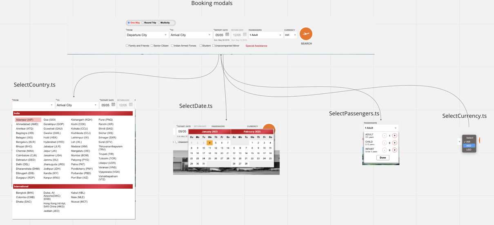
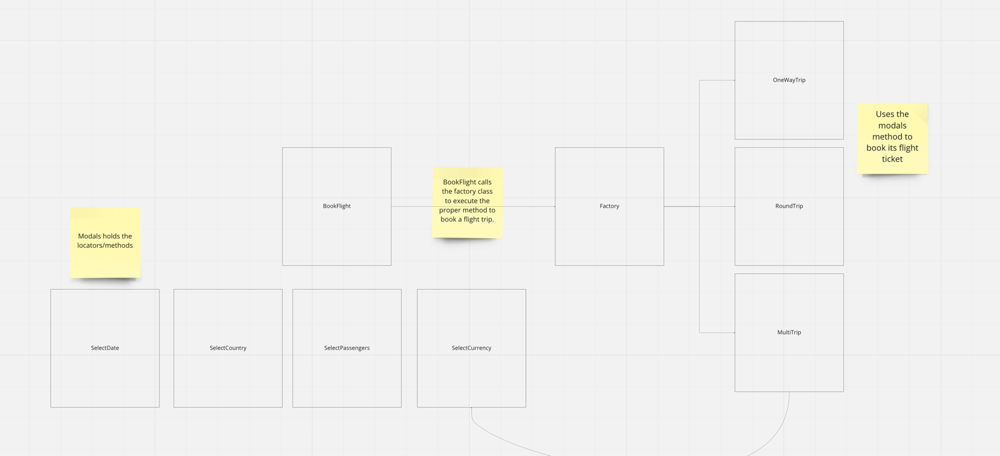

# Book Flight Test Strategy.

## Booking Modals.
The picture below shows what part BookFlight is responsible over.
There were too many features for one class to contain, so I split the component into modals.
The modals holds the locators / methods for their specific feature.
```ts
// The Component of the picture below.
export class BookFlight {
  private static instance: BookFlight;
  private _bookingFactory: BookingFactory;
  // Modals.
  readonly getSelectCountryModal: SelectCountry; 
  readonly getSelectDateModal: SelectDate;
  readonly getSelectPassengersModal: SelectPassengers;

  private constructor(protected page: Page) {
    this.page = page;
    this.getSelectCountryModal = SelectCountry.getInstance(page);
    this.getSelectDateModal = SelectDate.getInstance(page);
    this.getSelectPassengersModal = SelectPassengers.getInstance(page);
    this._bookingFactory = new BookingFactory(page);
  }

  static getInstance(page: Page) {
    if (this.instance && page === this.instance.page) return this.instance;
    this.instance = new BookFlight(page);
    return this.instance;
  }

  async bookAFlight(bookingInfo: FlightBookingInfo | RoundTripFlight): Promise<void> {
    await this._bookingFactory.createABookingForAFlightTrip(bookingInfo);
  }
}

```


## Booking Factory.

- For each type of booking ticket, one class was created, [oneWayTrip, multiTrip, RoundTrip].
- The Booking component calls the factory method to execute the given flight trip method.

```ts
export class BookingFactory {
  private _oneWayTrip: OneWayTrip;
  private _roundTrip: RoundTrip;
  private _multiTrip: MultiTrip;

  constructor(private page: Page) {
    this._oneWayTrip = OneWayTrip.getInstance(page);
    this._roundTrip = RoundTrip.getInstance(page);
    this._multiTrip = MultiTrip.getInstance(page);
  }

  async createABookingForAFlightTrip(bookingInfo: FlightBookingInfo | RoundTripFlight): Promise<void> {
    switch (bookingInfo.typeOfTicket) {
      case 'oneWayTrip':
        await this._oneWayTrip.bookAOneWayTripFlight(bookingInfo);
        break;
      case 'roundTrip':
        await this._roundTrip.bookARoundTripFlight(bookingInfo as RoundTripFlight);
        break;
      case 'multiTrip':
        await this._multiTrip.bookAMultiTripFlight(bookingInfo);
        break;
      default:
        throw new Error(`Pick either oneWay, roundTrip or multitrip as an option`);
    }
  }
}
```

