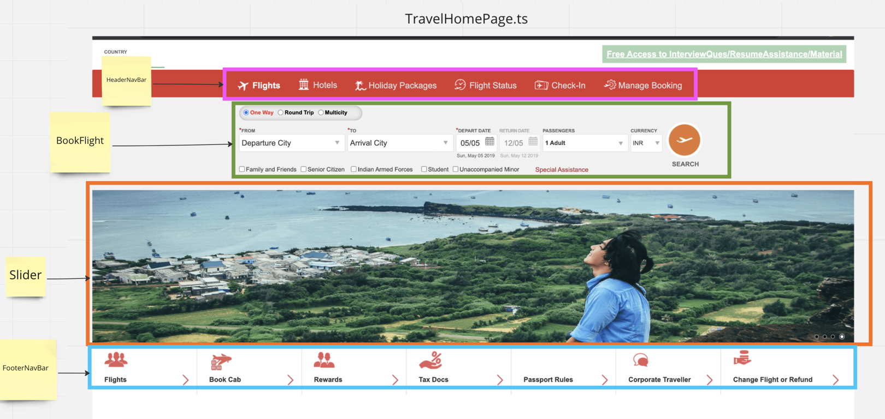

# Page object design.

The page objects follow the [single responsibility principle.](https://www.freecodecamp.org/news/solid-principles-single-responsibility-principle-explained/)  
One whole page is often too big for one class to contain. Therefore, splitting it into several different classes makes   
maintenance more manageable. If the page gets additional features, it allows for simple implementation by adding another class.

To demonstrate, see the picture below.
 - The navigation bar is common and is visible on all pages of the website. Therefore its placed under the common-component folder, so that other pages also may reuse the class.
 - The BookFlight component and the slider component belongs only to this page, and therefor will be placed under the TravelHome object as child classes.




```ts
/* 
 Step one:
 Create one parent class, that holds all of the component classes.
 No locators or methods are stored in the parent class... usually.
 */

export class TravelHome {
  readonly headerNavBarComponent: HeaderNavigationBar;
  readonly footerNavBarComponent: FooterNavigationBar;
  readonly flightBookingComponent: BookFlight;
  readonly slideComponent: Slider;

  constructor(private page: Page) {
    this.page = page;
    this.headerNavBarComponent = HeaderNavigationBar.getInstance(page);
    this.footerNavBarComponent = FooterNavigationBar.getInstance(page);
    this.flightBookingComponent = BookFlight.getInstance(page);
    this.slideComponent = Slider.getInstance(page);
  }
}
```
```ts
// The child class holds the locators / methods for that component.
export class Slider {
  private static instance: Slider;
  readonly slideNavigatorBtnElements: Locator;
  readonly sectionElement: Locator;

  private constructor(private page: Page) {
    this.page = page;
    this.slideNavigatorBtnElements = page.locator('[data-ikslider-control]');
    this.sectionElement = page.locator('[class="slider-container hide-mobile"]');
  }

  static getInstance(page: Page) {
    if (this.instance && page === this.instance.page) return this.instance;
    this.instance = new Slider(page);
    return this.instance;
  }

  async slideToImage(index:number) {
    await this.slideNavigatorBtnElements.nth(index).click()
  } 
}
```

```ts
 // Once can now easily navigate to the pages components and gives a nice BDD syntax to the code.
 const travelHomePage = new TravelHome(page);
 travelHomePage.sliderComponent.slideToImage(2);
```

